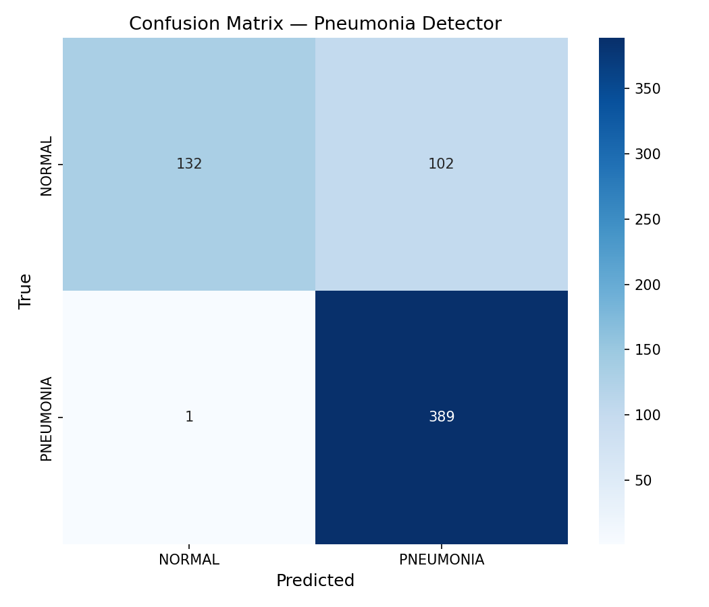
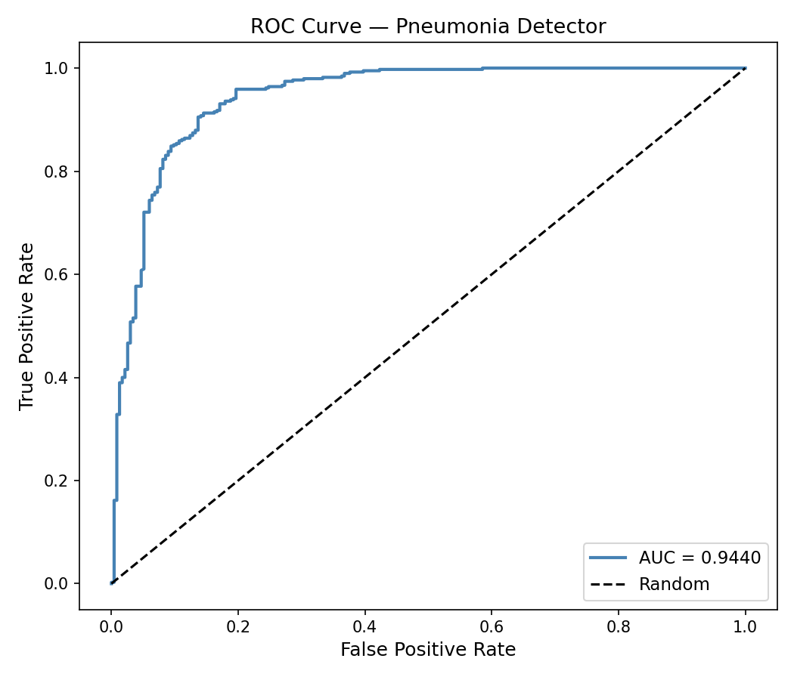

```markdown
# 🫁 Pneumonia Detection AI with Grad-CAM Explainability

> A deep learning system that detects pneumonia from chest X-rays and shows exactly where in the lung it found the abnormality.


 


 


 


---

## 📌 Overview

Most medical AI models are black boxes — they give you a prediction with no explanation. This model uses **Grad-CAM** to generate a heatmap showing exactly which region of the lung influenced the diagnosis. This is explainable AI applied to real clinical imaging.

The model is built on **ResNet18**, fine-tuned on 5,216 labeled chest X-rays, and wrapped in a full **Streamlit web UI** that anyone can use without writing a single line of code.

---

## 🎯 What It Does

- Takes any chest X-ray image as input
- Predicts **NORMAL** or **PNEUMONIA**
- Shows a **confidence score** on every prediction
- Generates a **Grad-CAM heatmap** highlighting the exact lung regions the model focused on
- Displays a **side-by-side view** of the original X-ray and the heatmap overlay
- Full **Streamlit web UI**

---

## 📊 Results

| Metric | Value |
|--------|-------|
| Test Accuracy | **83.49%** |
| Best Validation Accuracy | **93.75%** |
| AUC-ROC | **0.9440** |
| Pneumonia Recall | **1.00** |
| Training Epochs | **10** |
| Dataset Size | **5,216 images** |

Pneumonia recall of 1.00 means the model catches every single pneumonia case — critical in a clinical setting where false negatives are dangerous.

---

## 📈 Evaluation Plots

### Confusion Matrix





### ROC Curve





---

## 🚀 Quick Start

```bash
git clone https://github.com/Eddiegah/pneumonia-detector.git
cd pneumonia-detector
python -m venv venv
venv\Scripts\activate
pip install -r requirements.txt
python src/train.py
streamlit run app.py
```

---

## 📁 Project Structure

```
pneumonia-detector/
├── app.py
├── requirements.txt
├── src/
│   ├── train.py
│   ├── predict.py
│   ├── gradcam.py
│   └── evaluate.py
└── results/
    ├── figures/
    │   ├── confusion_matrix.png
    │   └── roc_curve.png
    └── metrics.json
```

---

## 🧰 Tech Stack

| Tool | Purpose |
|------|---------|
| PyTorch | Deep learning framework |
| ResNet18 | Pre-trained CNN backbone |
| Grad-CAM | Explainability heatmaps |
| Streamlit | Web UI |
| scikit-learn | Evaluation metrics |
| OpenCV | Image processing |
| Matplotlib | Plot generation |

---

## 💡 Why Grad-CAM?

Explainability is critical in medical AI. A model that says "pneumonia detected" without showing why cannot be trusted in a clinical setting. Grad-CAM bridges that gap by making the model's reasoning visible to clinicians.

---

## 🔗 Related Work

This project connects directly to my work at **Nexora**, a healthcare technology company focused on predictive modelling for early disease detection.

---

## 📄 License

MIT License

---

<p align="center">Built with 🫁 by <a href="https://github.com/Eddiegah">Eddiegah</a></p>
```
